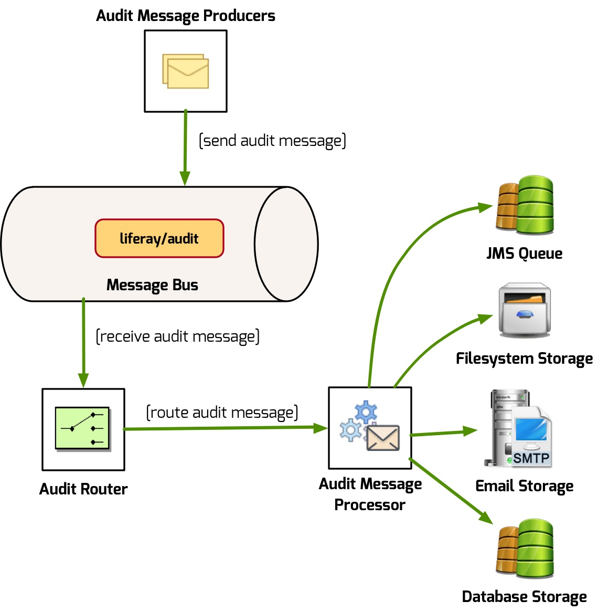
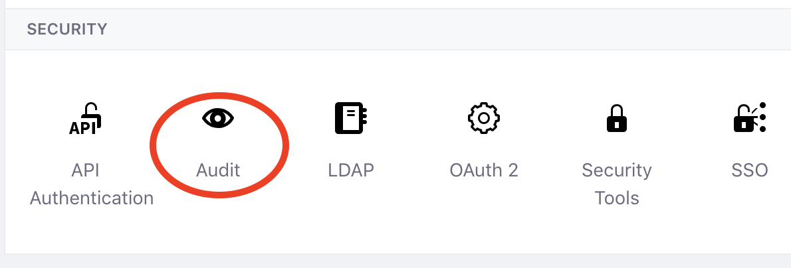
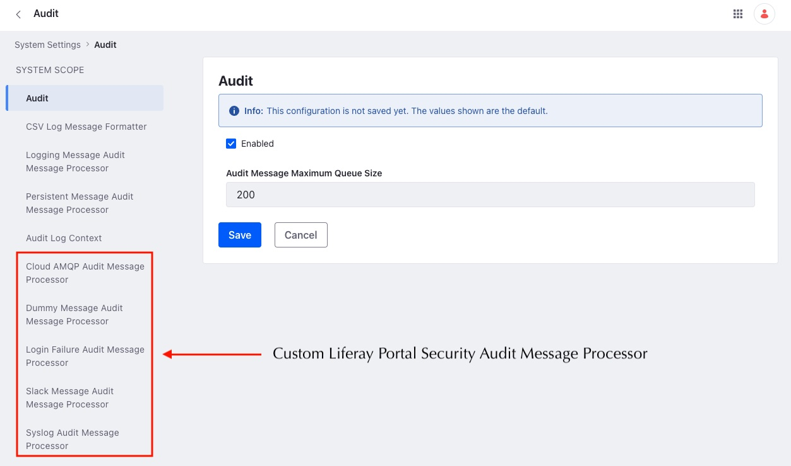
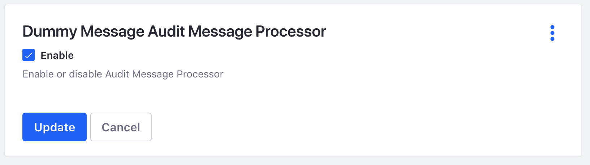
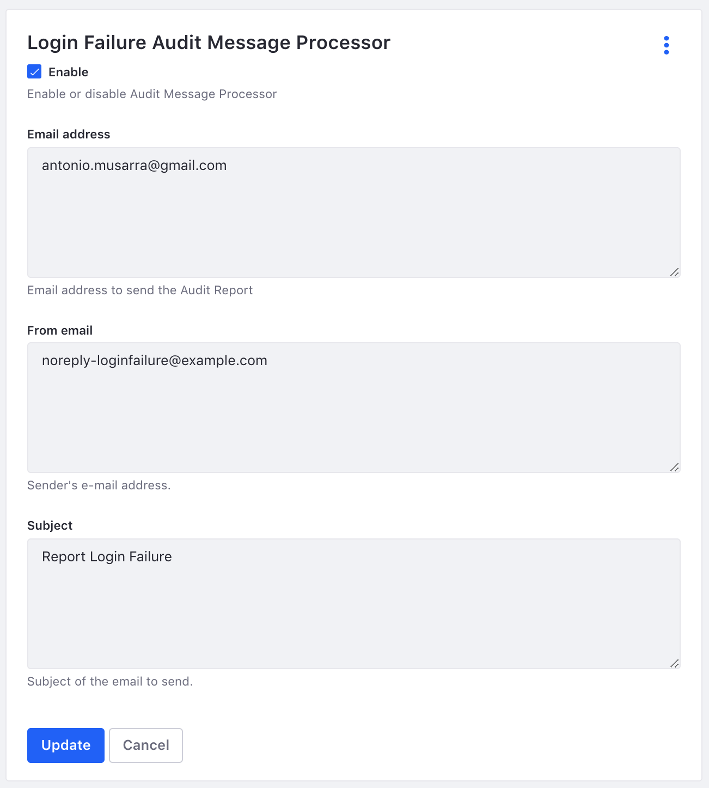
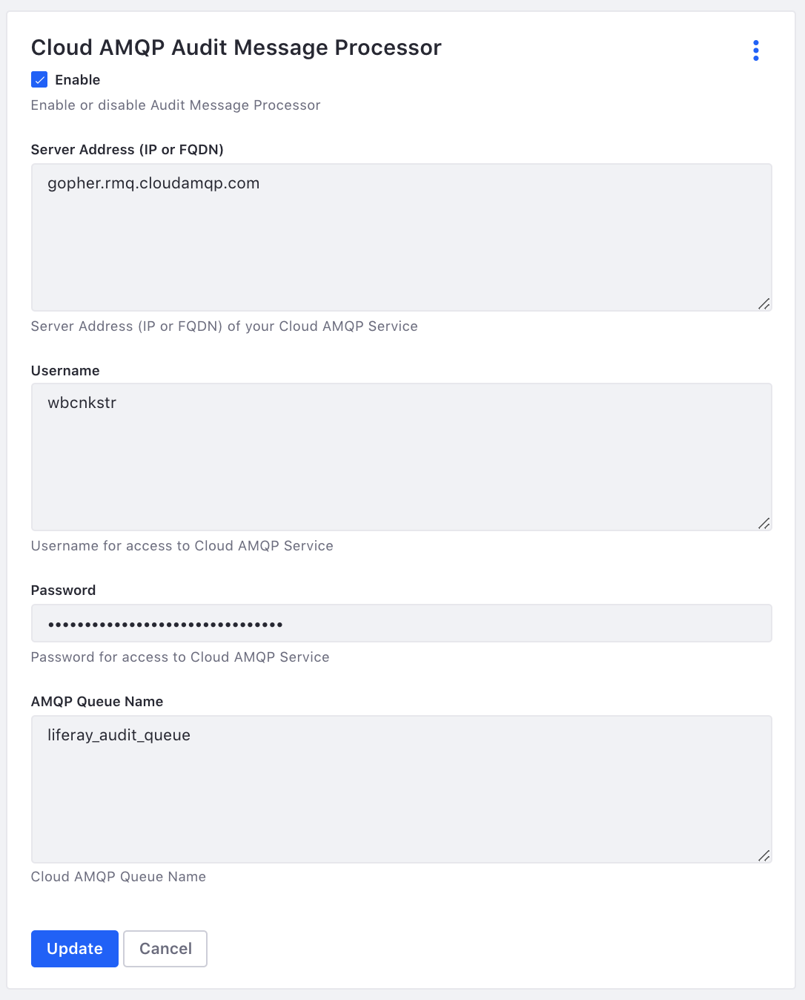
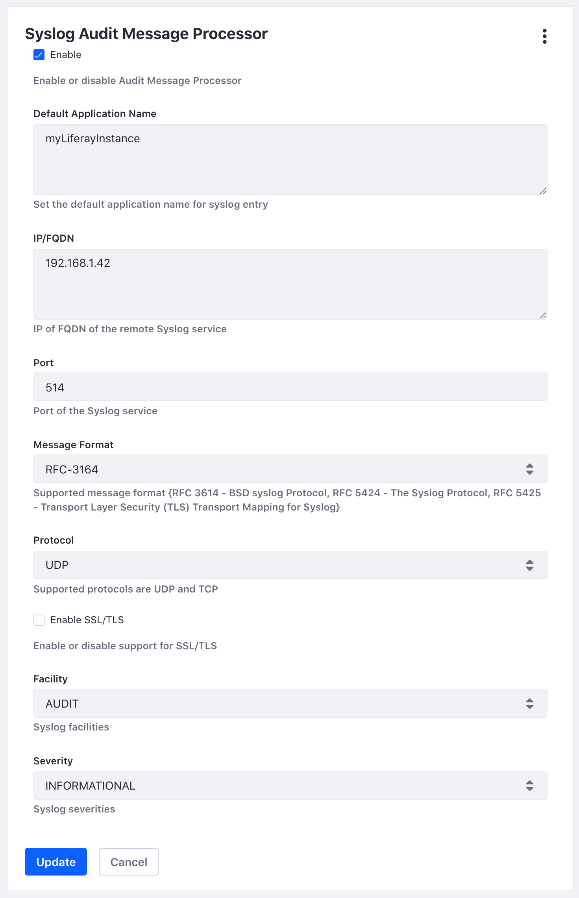
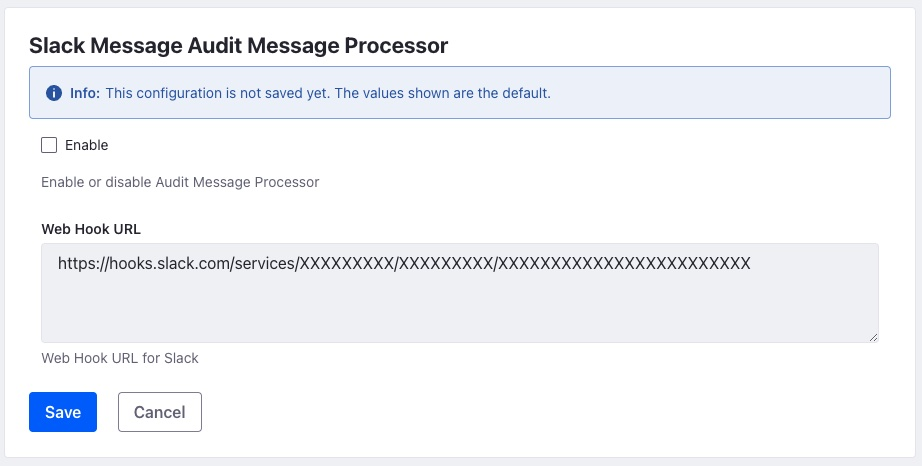
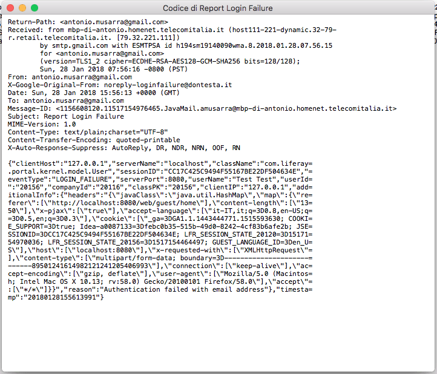
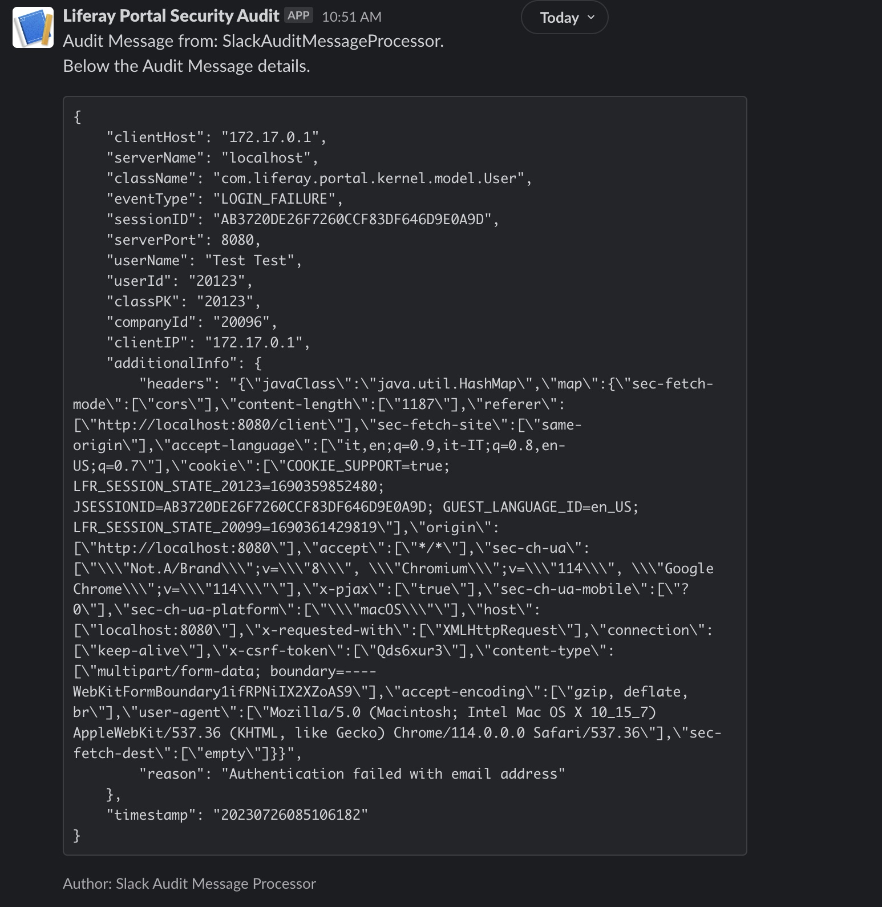

# Liferay 7 Portal Security Audit
[](https://www.dontesta.it)

[](https://sonarcloud.io/dashboard?id=amusarra_liferay-portal-security-audit)


This project refers to the ebook [Liferay Portal Security Audit](https://goo.gl/AC8VRo) published by
[Antonio Musarra's Blog](https://www.dontesta.it) on the Amazon Kindle Store.

At the beginning of the article the source code of
Liferay Portal Security Audit (freely available on GitHub) was examined.
Later, in the article we also discussed how to implement the OSGi components
necessary to obtain an Audit Service system running on the Community Edition of
Liferay. The project is organized as described in Table 1.



Figure 1. Macro Architecture of Liferay Portal Security Audit

| Name of the module  | Description |
| ------------- | ------------- |
| **portal-security-audit-capture-events**  | This module contains components that capture portal events such as AuthFailure. These components trace events by sending them to message processors through the Audit Router  |
| **portal-security-audit-router**  | This module contains the Standard Audit router component that implements the Audit Router interface  |
| **portal-security-message-processor** | This module contains the two message processors that we have implemented in the course of this article and which are: Dummy Audit Message Processor and Login Failure Message Processor  |

Table 1. New modules added to the Liferay Portal Security Audit system

Version 7.1 of Liferay has *introduced the implementation of a default router*, 
for this reason in this version of the project there is no longer the bundle
**portal-security-audit-router**.

The module **portal-security-audit-capture-events** contains the follow OSGi components for capture these events:
1. Login Failure
2. Login Post Action
3. Logout Post Action

The module **portal-security-message-processor** contains the follow OSGi components for processing audit messages:
1. Dummy Audit Message Processor
2. Login Failure Message Processor
3. Cloud AMQP Audit Message Processor
4. Syslog Audit Message Processor (from version 1.3.0)
5. Slack Audit Message Processor (from version 1.4.0)

For more information about the *Cloud AMQP Audit Message Processor* I advise you to read
[CloudAMQP Audit Message Processor for Liferay 7/DXP](https://dzone.com/articles/liferay-7-cloud-amqp-audit-message-processor)
that I published on DZone portal.

This project is an excellent starting point that you can certainly extend
according to your needs, thus obtaining an Audit Service system starting
from the framework at the base of the Liferay Portal Security Audit.
Shows the steps necessary to obtain and install the three modules
shown in Table 1.

```
$ git clone https://github.com/amusarra/liferay-portal-security-audit.git
$ cd liferay-portal-security-audit
$ ./gradlew clean deploy
$ cp ../bundles/osgi/modules/*.jar $LIFERAY_HOME/deploy/
```
Console 1 - Steps to obtain and install the modules

In the case `$LIFERAY_HOME` is set on this directory 
`/Users/amusarra/dev/liferay/liferay-ce-portal-7.2.1-ga2`

Verify the correct deployment of the two bundles via the Liferay log file or
through the Gogo Shell using the `lb` command, making sure that the status is
Active.

From Liferay version 7.1 GA1 access to the GogoShell via telnet has been disabled. 
To re-enable access, you need to set the portal in developer mode. Form more info
read this [setting developer mode for your server using portal-developer.properties](https://help.liferay.com/hc/en-us/articles/360018162091-Using-Developer-Mode-with-Themes)

You can use Docker to run a Liferay 7.4 GA85 instance and deploy the bundles.
Using the following Docker command. Form more information about Liferay Docker,
read this [Starting with a Docker Image](https://learn.liferay.com/w/dxp/getting-started/starting-with-a-docker-image?p_l_back_url=%2Fsearch%3Fq%3DDocker&highlight=Docker)

```
$ docker run -it -m 8g -p 8080:8080 -p 11311:11311 -v $(pwd):/mnt/liferay liferay/portal:7.4.3.85-ga85
```
Console 2 - Run Liferay 7.4 GA85 as container

```
$ telnet localhost 11311

g! lb Audit
START LEVEL 20
   ID|State      |Level|Name
 1113|Active     |   10|Liferay CE Foundation - Liferay CE Portal Security Audit - API (1.0.0)|1.0.0
 1114|Active     |   10|Liferay Portal Security Audit API (8.0.0)|8.0.0
 1115|Active     |   10|Liferay Portal Security Audit Event Generators API (6.2.0)|6.2.0
 1116|Active     |   10|Liferay Portal Security Audit Storage API (8.0.0)|8.0.0
 1204|Active     |   10|Liferay CE Foundation - Liferay CE Portal Security Audit - Impl (1.0.0)|1.0.0
 1205|Active     |   10|Liferay Portal Security Audit Event Generators User Management (5.0.11)|5.0.11
 1206|Active     |   10|Liferay Portal Security Audit Implementation (4.0.7)|4.0.7
 1207|Active     |   10|Liferay Portal Security Audit Router (6.0.19)|6.0.19
 1208|Active     |   10|Liferay Portal Security Audit Storage Service (6.0.37)|6.0.37
 1209|Active     |   10|Liferay Portal Security Audit Wiring (6.0.21)|6.0.21
 1609|Active     |   10|Liferay Portal Security Audit Capture Events (1.2.0.SNAPSHOT)|1.2.0.SNAPSHOT
 1610|Active     |   10|Liferay Portal Security Audit Message Processor (1.3.0.SNAPSHOT)|1.3.0.SNAPSHOT
```
Console 3 - Verify the correct deployment of the two bundles via the Gogo Shell

As you can see, since version 7.2 of Liferay has introduced several more bundles about 
the audit framework. One of the most important bundles is the one implements 
the Audit Router.

After installing the two bundles, you can access the configuration via the
Liferay control panel.



Figure 1. OSGi Configuration of the Audit bundles.



Figure 2. General Audit Configuration and configuration for the custom Audit Message Processor.



Figure 3. OSGi Configuration of the Dummy Message Audit Processor.



Figure 4. OSGi Configuration of the Login Failure Message Audit Processor.



Figure 5. OSGi Configuration of the CloudAMQP Message Audit Processor.



Figure 6. OSGi Configuration of the Syslog Message Audit Processor.



Figure 7. OSGi Configuration of the Slack Message Audit Processor.

The Slack Audit Message Processor use the [Slack Web API](https://api.slack.com/web) to send messages 
to Slack using the [Incoming Webhooks](https://api.slack.com/messaging/webhooks) feature.

If you enable Audit, then the two message processors and finally the Scheduler
Helper Engine, on Liferay log files, you will see the audit messages (of the
running jobs, of the login processes, etc.). If you were to fail the login
process, you should see the attempt to send the email containing the audit
message to the log file.

```
15:30:42,954 INFO  [liferay/audit-1][DummyAuditMessageProcessor:48] Dummy
processor processing this Audit Message =>
{"companyId":"20116","classPK":"20156","clientHost":"127.0.0.1","clientIP":
"127.0.0.1","serverName":"localhost","className":"com.liferay.portal.kernel.model.User",
"sessionID":"6C77D209E6068DAC47FFA4435B7B05B6","eventType":"LOGIN",
"serverPort":8080,"userName":"Test Test","userId":"20156",
"timestamp":"20180128153042954"}
```
Log 1. Dummy Audit Message Processor that trace the LOGIN event

```
15:56:13,993 INFO  [liferay/audit-1][LoginFailureAuditMessageProcessor:75]
Send report audit email to antonio.musarra@gmail.com
```
Log 2. Login Failure Audit Message Processor that trace LOGIN_FAILURE event
and send email

```
2018-09-11 20:12:45.037 INFO  [liferay/audit-1][CloudAMQPAuditMessageProcessor:125]
 Message Audit processed and published on liferay_audit_queue Cloud AMQP queue. 
 Details {{product=RabbitMQ, copyright=Copyright (c) 2007-2017 Pivotal Software, 
 Inc., capabilities=
 {exchange_exchange_bindings=true, connection.blocked=true, 
 authentication_failure_close=true, basic.nack=true, publisher_confirms=true, 
 consumer_cancel_notify=true}, information=Licensed under the MPL. 
 See http://www.rabbitmq.com/, version=5.1.2, platform=Java}}
```
Log 3. CloudAMQP Audit Message Processor that trace LOGIN_FAILURE event

```
Sep  4 15:36:43 400 <110>1 2020-09-04T13:36:43.646Z 192.168.1.7 myLiferayInstance - - - {"classPK":"35501","companyId":"20098","clientHost":"192.168.1.7","clientIP":"192.168.1.7","serverName":"192.168.1.7","className":"com.liferay.portal.kernel.model.User","eventType":"LOGIN","sessionID":"B96A590FF50471CD9DB393A45772E063","serverPort":8080,"userName":"Antonio Musarra","userId":"35501","timestamp":"20200904133643646"}
Sep  4 13:38:38 192.168.1.7 myLiferayInstance {"classPK":"35501","companyId":"20098","clientHost":"192.168.1.7","clientIP":"192.168.1.7","serverName":"192.168.1.7","className":"com.liferay.portal.kernel.model.User","eventType":"LOGOUT","sessionID":"B96A590FF50471CD9DB393A45772E063","serverPort":8080,"userName":"Antonio Musarra","userId":"35501","timestamp":"20200904133838532"}
```
Log 4. Entry on the remote syslog server with two different message format. 




Figure 8. Email send by Login Failure Audit Message Processor



Figure 9. Login Failure Audit Message Processor Slack Message

## Team Tools

[](https://www.jetbrains.com/?from=LiferayPortalSecurityAudit) 

Antonio Musarra's Blog Team would like inform that JetBrains is helping by 
provided IDE to develop the application. Thanks to its support program for 
an Open Source projects !

[](https://sonarcloud.io/dashboard?id=amusarra_liferay-portal-security-audit)

Liferay Portal Security Audit project is using SonarCloud for code quality. 
Thanks to SonarQube Team for free analysis solution for open source projects.

## License
MIT License

Copyright 2009-2023 Antonio Musarra's Blog - https://www.dontesta.it

Permission is hereby granted, free of charge, to any person obtaining a copy
of this software and associated documentation files (the "Software"), to deal
in the Software without restriction, including without limitation the rights
to use, copy, modify, merge, publish, distribute, sublicense, and/or sell copies
of the Software, and to permit persons to whom the Software is furnished to do so,
subject to the following conditions:

The above copyright notice and this permission notice shall be included in all
copies or substantial portions of the Software.

THE SOFTWARE IS PROVIDED "AS IS", WITHOUT WARRANTY OF ANY KIND, EXPRESS OR
IMPLIED, INCLUDING BUT NOT LIMITED TO THE WARRANTIES OF MERCHANTABILITY,
FITNESS FOR A PARTICULAR PURPOSE AND NONINFRINGEMENT. IN NO EVENT SHALL THE
AUTHORS OR COPYRIGHT HOLDERS BE LIABLE FOR ANY CLAIM, DAMAGES OR OTHER LIABILITY,
WHETHER IN AN ACTION OF CONTRACT, TORT OR OTHERWISE, ARISING FROM, OUT OF OR IN
CONNECTION WITH THE SOFTWARE OR THE USE OR OTHER DEALINGS IN THE SOFTWARE.
